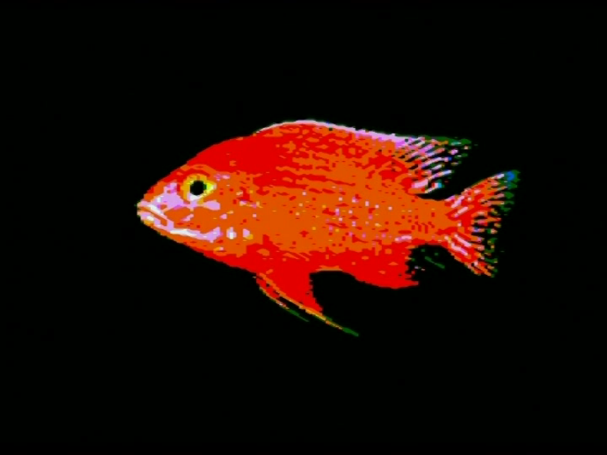
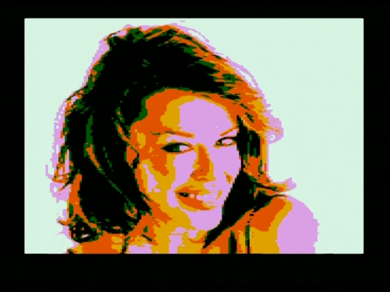

# ATMega based home computer

In the following an ATMega162 based home computer system built at the beginning of 2010 is described. The system is connected to a TV using SCART, a standard PS/2 keyboard works as an input device and SD card access allows to transfer programs and data to / from SRAM (128 kB).

An ATMega microcontroller is a Harvard architecture machine. So to be able to load and run arbitrary code without reprogramming the flash memory the code has to be interpreted. Therefore the ATMega emulates a 6502 processor (→ von Neumann architecture).

Like for many early 1980s home computers the programming language BASIC, an assembler and games are available for the system.

One of the design goals was to keep the hardware simple, i.e. using only DIL packaged "standard" chips (no CPLD).

The following video gives an overview of the possibilities of the system. All images and sounds in the video are produced by the home computer (with the exception of the computer voice which describes the system).

[](https://youtu.be/RmvYe_Xr4fc)

Please see chapter [Installation](#installation) on how to build an install the software.

## Hardware

### Features

- Different video modes (16 colors available): text modes, multicolor mode
- Basic sound capabilities
- Access to SD cards (preferably SanDisk SD cards)
- PS/2 keyboard interface
- 128 kByte SRAM
- SPI interface (also used as ISP interface to program the microcontroller)
- Power LED, reset button, power on / off
- No overclocking (ATMega162 is clocked at 16 MHz)

### Scheme

The most interesting part of the scheme is video generation.

The TV synchronization signals are generated using ATMega's output compare unit B of timer 3 (OC3B). Image data are put out in an interrupt routine using output compare unit A of timer 3.

The hardware allows to select two basically different ways to output the image data: modes, which put image data into the 74HC165 and color information into the 74HC257 (text modes) and modes, which put a fixed pattern into the 74HC165 and image data / color information into the 74HC257 (multicolor mode).

The following scheme has been used in conjunction with the DVD-116U-DIKOM case (see below). Note, that the "video signal connector" is *not* a SCART connector.


The following scheme is more appropriate if the SCART connector should be on the board itself (*not* used to build the actual board, so verify the scheme before using it).


### ATMega 162 fuse bytes

- Fuse Low Byte      = 0x60 (external clock)
- Fuse High Byte     = 0xd9 (JTAG disabled)

### Color palette


### PCB and case

I started with a very cheap DVD player (DIKOM DVD-116U), removed the disk drive mechanism and electronic components only leaving the voltage regulation inside the case. I then designed the PCB around this case.


Backside: Power cable, SCART connector, power on/off, PS/2 connector, ISP connector


Frontside: SD card slot, reset button, power LED


Michał Przybył (<mickpr@poczta.onet.pl>) made a SMD version of the home computer.


## System software

### Video Modes

- Text mode 1: 40x25 chars (8x8 pixels), 2 colors out of 16 colors per char, press ctrl-t to switch to text mode
- Text mode 2: 44 chars (char dimensions: 8 pixels wide, variable height) per row, can also be used as a hires mode
  similar to the VIC 20 hires mode with resolutions up to 352x240 pixels resp. 352x480 pixels in interlace mode
  (2 colors out of 16 colors per 8x1 pixel block)
- Multicolor mode: 160x200 pixels, 16 colors, each pixel's color is independent of other pixels,
  press ctrl-m to switch to multicolor graphics mode

### 6502 Emulation

- Emulation does not include "undocumented" instructions
- The seldom used decimal mode is only partly emulated (status flags N, Z and V are not properly emulated)
- 3 additional instructions: callatm (call an ATMega service routine), jmpsh (quit emulation, jump back to shell),
  dbgit (print debug information)
- 6502 interrupt sources: vertical sync. signal, timer, ctrl-d
- Emulation can be quit at any time by pressing ctrl-esc
- Shifted address space to avoid "zero page collisions" (see Development)
- Simple debugging possibilities

### Sprites

- Size and number of sprites are only limited by memory and MCU time
- Available only in multicolor mode
- Same resolution / colors as multicolor mode graphics
- Basic collision detection
- Transparent color is freely selectable for each sprite separately

### File System

The system supports SD cards formatted with the FAT16 file system (sector size must be 512 bytes, no SDHC support currently).

Files and directories can be accessed by an absolute or relative path. The path separator is the forward slash (/). The root directory is accessed by a single forward slash (/). Files or directories can only be accessed by their 8.3 filename. One dot (.) represents the current directory, two dots (..) represent the parent directory (doesn't work if the parent directory is the root directory).

### Shell

The shell allows to interact with the system. It allows to run one of the built-in commands or to load and execute a 6502 program.

The following built-in commands are available:
- cd [dir]: Changes the actual directory to the directory dir. If no argument is given, the actual directory is set to the root directory.
- ls [dir]: Lists the directory given in dir or, if no argument is given, the actual directory. Two columns are displayed on the screen:
  file size and file name. Because the file size column is a 16 bit integer, only sizes up to 65535 are displayed correctly. If there are
  too much entries in a directory to be displayed on the screen, paging will be activated (press q to quit, press <enter> for one further
  entry, press any other key to display one further page).
- load filename [addr]: Loads the program or data stored in the file filename to the default load address or the deposited address
  (see below). If a second argument is given, the program or data is loaded to memory location addr (ATMega address).
- save filename [addr]: Saves the program or data located at the default load address (see below) or, if a second argument is provided,
  at the given memory location addr (ATMega address) to the existing file filename. The number of bytes to write is given by the size of
  the existing file. Using the command save, it is not possible to create new files.
- fsinit: Enables access to the file system of the inserted SD card. This is executed automatically during a reset resp. power up of the
  system.
- peek addr: Reads the content of a memory cell at the specified location addr (6502 address) and prints it at the actual cursor position.
- poke addr val: Sets the content of a memory cell to the value val at the specified location addr (6502 address).
- sys addr: Executes 6502 code starting at the specified memory location addr (6502 address).
- reset: Resets the system.
- spilo: Activate the SPI interface (PD1 low).
- spihi: Deactivate the SPI interface (PD1 high).

If the following conditions are met, a 6502 program can be executed by simply typing its name in the shell (followed by pressing <enter>):
- The 6502 program must reside in the /BIN directory or in the actual directory and
- it must have an "AUTO magic number" (byte 0: value of opcode jmp = 76; byte 1,2: arbitrary jump address; byte 3-6: string "AUTO").

Otherwise, code or data must be loaded to memory using the "load" command. Subsequently, code can be executed using the "sys" command.

The default load address equals to START6502CODE (= 2512 in 6502 emulation mode). It can be changed by including a "LOAD magic number" in the file (byte 7-10: string "LOAD"; byte 11,12: arbitrary load address (ATMega address)).

### Further features

- Driver for a standard PS/2 keyboard
- PCM audio (8 bit, max. rate: 15600 Hz)
- Tiles & Scrolling
- SPI communication routines

## Images

Images are converted from standard formats (png, jpg etc.) to a "raw" format (which can directly be displayed by the home computer) using a shell script. The shell script mainly uses ImageMagick's convert to do the job.

### Multicolor mode images

<p float="left">
  
  
  
</p>
<p float="left">
  
  
  
</p>
<p float="left">
  
  
</p>

### Hires mode images

<p float="left">
  
  
</p>
<p float="left">
  
  
</p>

### Interlaced hires mode images

<p float="left">
  
  
</p>

## Games

Among others the following games are available for the system.

### Pac-Man

Pac-Man is written in 6502 code calling ATMega service routines to do the sprite handling.
The maze is an exact copy of the maze in the C64-version of Pac-Man.
Ghost-AI is pretty similar to that of the original arcade game (see the excellent Pac-Man Dossier of Jamie Pittman).
The game has a demo and 10 levels with increasing difficulty.
There is also a "cheat poke" to get unlimited number of lifes, immunity or the possibilty to skip levels. This has been used to go to the 9. level in the following video.

[](https://youtu.be/DVQPfbBUThU)

### Wonder Boy

Wonder Boy is written in 6502 assembler code. ATMega service routines are used to draw the sprites and to copy the tiles.

[](https://youtu.be/R7MMEBWtulI)

Sprites and tiles were generated using GIMP, ImageMagick and KIconEdit on screenshots from the arcade version of Wonder Boy. Levels are generated using the Tiled Map Editor. Up to now two levels are available.

<p float="left">
  
  
</p>

### C Lode Runner

C Lode Runner is written in C using the ncurses library. To make movements of the runners more fluent, three characters are used to move
from one character position to the next (resulting in "4 pixel moves").

[](https://youtu.be/_Ho5lc3kKAU)

### Catkanoid

Catkanoid is an arkanoid clone from Sebastian Mihai written in C using the tgi library.

<p float="left">
  
</p>

### Galaga (C64)

I ported Galaga from the C64 to my system. This was not too difficult because only a few hardware specific registers are used by "PET Galaga". Mainly the following code adaptions had to be done:
- replacing the C64 "voice 1 frequency" address with the corresponding address of my computer
- adapting the keyboard reading code
- implementation of the necessary kernal routines CHROUT and GETIN
- installing the "timer interrupt handler"

[](https://youtu.be/8N6iDmxU50I)

### Space Invaders (PET)

I ported Space Invaders from the Commodore PET to my system.

[](https://youtu.be/asKYQjaMV4w)

### VIC 20 Games - Star Battle, Miner, Lode Runner

To keep adaptions of the original VIC 20 code to a minimum the vertical sync interrupt is used to implement the following tasks:
- copy screen content from VIC screen memory to R162 screen memory
- if necessary, copy char definitions from VIC to R162
- read R162 keyboard / joystick registers and copy the necessary information to the corresponding VIC joystick register(s)

The following video show the VIC 20 games Star Battle, Miner 2049er and Lode Runner running on my system.

[](https://youtu.be/jKS71lzkh9M)

### Four in a row

The "four in a row" game is pure C code using the ncurses library. I developed the game on a linux computer and then cross compiled the code to my home computer system using the "cc65 cross development package".
When playing against the computer, the game uses the min-max algorithm to find the "best" move.

<p float="left">
  
</p>

### Sokoban

Sokoban is a C program using the ncurses library (with an additional function "defch" to redefine a character) and standard file access functions (fopen, fread, rewind etc.). The program needs a "sokoban level set file" as an argument from which it can load the levels sequentially. Sokoban level sets are available on the internet.

The program soko is located in the /BIN directory, sokoban level sets are put in the directory /DATA/SOKO.

<p float="left">
  
  
</p>

### Microchess

I assembled Peter Jennings Microchess for the system.
The original text user interface is very basic and hard to use. I therefore added a graphical user interface.

<p float="left">
  
</p>

### Scott Adams adventure interpreter

I ported the Scott Adams free adventure interpreter by Alan Cox (C code). The interpreter has been enhanced to display a picture of the current location (if available). Adventures for the interpreter (database files) are available on the Interactive Fiction Archive
(https://www.ifarchive.org/indexes/if-archiveXscott-adamsXgamesXscottfree.html).

The following pictures are from the adventure "ADVENTURELAND" from Adam Scott:

<p float="left">
  
  
  
</p>

## Applications

### R162 assembler

A simple 6502 two-pass assembler written in C. In general, it accepts the more-or-less standard 6502 assembler format with the restriction, that only decimal and ASCII values are permitted (no hexadecimal or binary values). As usual, it is possible to define labels either by marking a memory location or by explicitly assigning a constant value. The following pseudo-ops are available: .byt, .word, .dsb, .asc.

### R162 editor

A simple full screen editor written in C.

Help page:
```
   edit (copyright by retroelec)
   -----------------------------
   help page
   ctrl-s : save buffer
   ctrl-q : quit
   ctrl-k : kill line
   ctrl-c : copy line
   ctrl-y : paste line
   ctrl-i : insert new line
   ctrl-g : goto line
   ctrl-f : search buffer
   ctrl-h : display this help page
   press any key to go back
```

### Basic

"Enhanced Basic" from Lee Davison (assembler code). Implementation of the SAVE command is realized by using C code (generated object code is linked with the Basic assembler code).

I ran the benchmark test described [here](http://www.retroprogramming.com/2010/01/8-bit-home-computer-benchmarks.html).
The basic program on my hardware needed 245 seconds (C64: 254 seconds, Atari 800XL: 316 seconds, Sinclair Spectrum +3: 388 seconds).

### Utilities

- cp: copy a file
- rm: delete a file
- creat: create a new empty file
- more: simple pager
- mon: simple memory monitor

### WAV player

wavplay: wav player to play PCM sound data in the famous RIFF WAVE format. PCM sound data must meet the following requirements: sample size: 8 bit, max. sample rate: 15600 Hz, 1channel

To convert an arbitrary PCM wav file to the needed format, sox can be used (e.g. sox input.wav -r 15600 -c 1 -b 8 output.wav)

## 6502 Development

### 6502 Assembling

I use Andre Fachat's open-source 6502 cross assembler [xa](https://www.floodgap.com/retrotech/xa/) when working on linux
(I use the R162 assembler when working on the home computer itself). The hardware is integrated by writing to resp. reading
from "registers" and calling ATMega service routines. The corresponding definitions are put into the include file 6502def.inc.

### Address space

For both, 6502 processor and ATMega controller, the "zero page" (memory address 0-255) is the most important memory region. Therefore when emulating the 6502 the address space is shifted by 768 bytes in comparance to the ATMega; i.e. address 0 in the 6502 memory corresponds to address 768 in the ATMega memory.

Usually the 6502 emulation considers this shift. However, when using "system pointers" (e.g. pointer to the start of the multicolor memory map) the shift between the address spaces has to be considered by adding 768 bytes to the 6502 address (e.g. lda #<(MCOLORMAPDEFAULT+768): sta MCOLORMAPP768: lda #>(MCOLORMAPDEFAULT+768): sta MCOLORMAPP768+1). The names of such "system pointers" end with the token "P768".

### 6502 C Cross Development

I ported the [cc65 cross development package](https://www.cc65.org/) of Ullrich von Bassewitz to my system. I implemented support for
different libraries for the home computer like file access to the FAT file system, a subset of the ncurses library and a subset of the
tgi library.

### Debugging

There is some built-in support to debug a 6502 program. Debugging can be initiated either by setting the DEBUGONOFF register (i.e. poke 65303 1) before the start of a 6502 program or by setting bit 6 of the internal interrupt register REGINT6502 during the execution of a 6502 program.

If debugging is activated by setting the register DEBUGONOFF a first breakpoint is automatically set at the start address of the 6502 program and the debug shell is entered when starting the program. In the debug shell itself additional breakpoints can be set. The debug shell uses particular memory regions given by the pointers DEBUGTEXTMAPP768 (default address: 27136) and DEBUGCOLORMAPTXTP768 (default address: 28160) to display text. These memory regions may not overlap with the memory regions used by the 6502 program to be debugged. It therefore may be necessary to set these pointers to new memory locations before the start of debugging.

The following debug commands are available:
```
    l: list breakpoints
    b addr: set a new breakpoint at address addr
    d addr: delete the breakpoint at address addr
    m addr: print content of memory at address addr (peek)
    f addr val: put value val to address addr (poke)
    s: execute a single 6502 command before returning to debug shell
    t: clear pending interrupts and execute a single 6502 command before returning to debug shell
    x: exit debug shell, continue execution of 6502 code
    q: quit 6502 program
```

## Files on github

Hint: I didn't put source code on github which were developed by other people. However you can find the corresponding binaries
in the bin directory.

### Schema and board data files

EAGLE (see http://www.autodesk.com/products/eagle/overview) schema and board data files are saved in the directory hw.
Files I used in conjunction with the DVD-116U-DIKOM case: r162dl.sch and r162dl.brd (used to create the PCB). 
Files that may be more appropriate if the SCART connector should be on the board itself: r162_scart.sch and r162_scart.brd (*UNTESTED*).

You can find the Altium Designer project files made by Michał Przybył (<mickpr@poczta.onet.pl>) in the file hw/Retroelec.7z.

### Source code

In the src directory the source code to program the ATmega and several programs using the 6502 emulation are available.

### Custom cc65 target

In the directory cc65_r162 you can find specific code and makefiles used to compile c code for the system with the
cc65 cross development package of Ullrich von Bassewitz.

### Graphics

Some graphics for the system are stored in the directory data/pics/multicol.

### Binaries

Binaries are also provided (in case you don't want to assemble / compile the source code on your own) in the bin directory.

## Installation

It is assumed in the following that you are working under Linux.

### Download Code to Microcontroller

To assemble the ATMega system code [AVRA](https://avra.sourceforge.net/) can be used:
```
avra main.asm -m main.map
```
or simply call the corresponding makefile target in the r162 directory:
```
make atmega
```
Alternatively the assembled ATMega hex file is also stored in the bin directory.

I use [avrdude](https://www.nongnu.org/avrdude/) with the AVRISP mkII programmer to download the hex file to the ATMega 162:
```
avrdude -V -P usb -p m162 -c avrisp2 -U flash:w:main.hex
```
Important: You have to remove the SD card before start flashing the microcontroller (because both, SD card and ISP use SPI).

### Install cc65

Use the following instructions to install the cc65 compiler:
- Download the cc65-sources-2.13.3.tar.bz2 package from ftp://ftp.musoftware.de/pub/uz/cc65/
  (see https://www.cc65.org/oldindex.php#Download).
- Unpack the package in the main (r162) directory.
- Copy the r162 specific sources and makefiles to the cc65 directory:  
```
cp -r cc65_r162/* cc65-2.13.3/
```
- Compile the cc65 compiler and the c programs (calling from the main (r162) directory):  
```
make c
```

### Prepare SD card

Format your SD card with the FAT16 file system (sector size must be 512 bytes, no SDHC support currently).
In the following example the SD card is mounted as /dev/mmcblk0p1 (labeling of the SD card is optional):
```
sudo mkdosfs -F 16 /dev/mmcblk0p1
sudo mlabel -i /dev/mmcblk0p1 ::R162
```

### Copy binaries to SD card

To assemble / compile the binaries you can use the makefile target all6502 (first target in the makefile,
so you just can type make in the r162 directory). Afterwards you can use the install target to copy the
binaries to the SD card (you have to adapt the SDCARD environment variable):
```
make
make SDCARD=/media/daniel/R162 install
```
Alternatively you can just copy the provided BIN and the DATA directory (in the bin directory) to the SD card.

